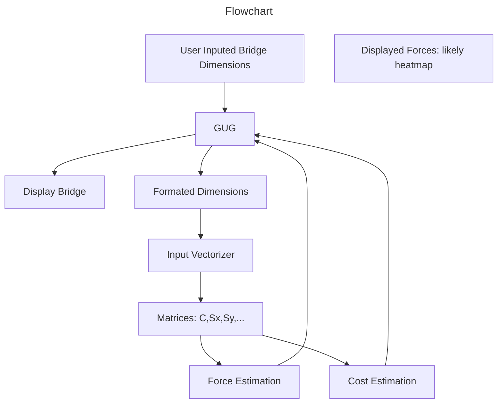

# Bridge_Sim_Engine
Interactive Bridge Simulation for an ideal truss bridge, with complete force analysis, cost estimation, and GUI

```mermaid
---
title: Flowchart
---
flowchart TD
manualIn["User Inputed Bridge Dimensions"]
display["Display Bridge"]
GUI["GUG"]
FDIMS["Formated Dimensions"]
IV["Input Vectorizer"]
M["Matrices: C,Sx,Sy,..."]
FE["Force Estimation"]
CE["Cost Estimation"]
FORCE["Displayed Forces: likely heatmap"]

manualIn --> GUI
GUI --> display
GUI --> FDIMS
FDIMS --> IV
IV --> M
M --> FE
M --> CE
FE --> GUI
CE --> GUI

```

