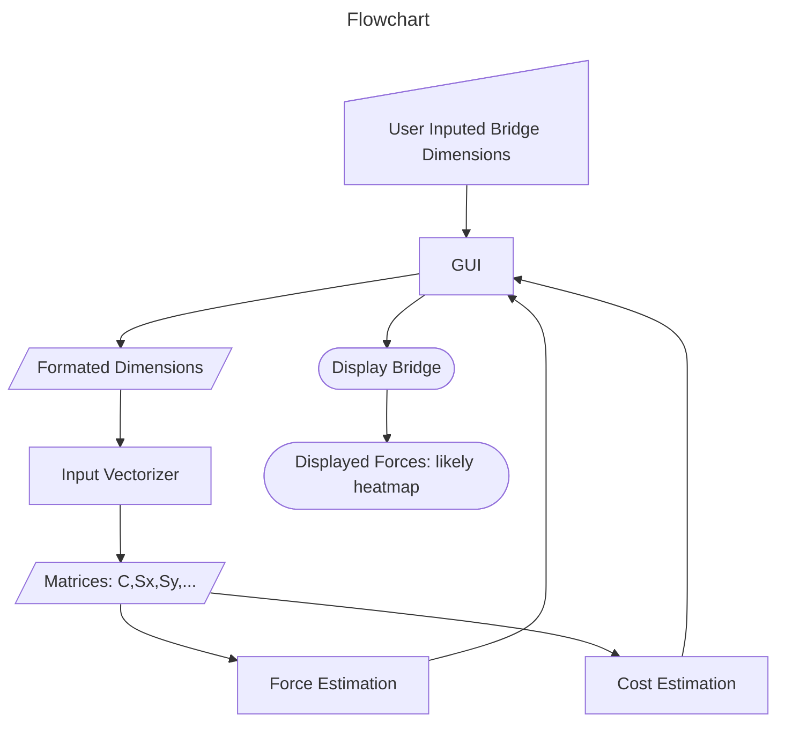

# Bridge_Sim_Engine
Interactive Bridge Simulation for an ideal truss bridge, with complete force analysis, cost estimation, and GUI

To Run the GUI, run 'gui_rename' in a matlab envirment.

(will change to better name when we refactor)

